# **TypeR Forum**

`To open the links in this document in a new browser tab please press CTRL + Mouse Click`

Welcome to the forum where the users will be able to exchange experiences, ideas and solutions.

The website is targeted for everyone, from every age group, what it counts and matters is the TypeR spirit.

You can expect a website that is easy to navigate and a friendly community that is ready to help each other.

The main goal of the forum is to create a community where people will help and share their problems that they may have encountered, experiences with a certain TypeR model, any thoughts and ideas.

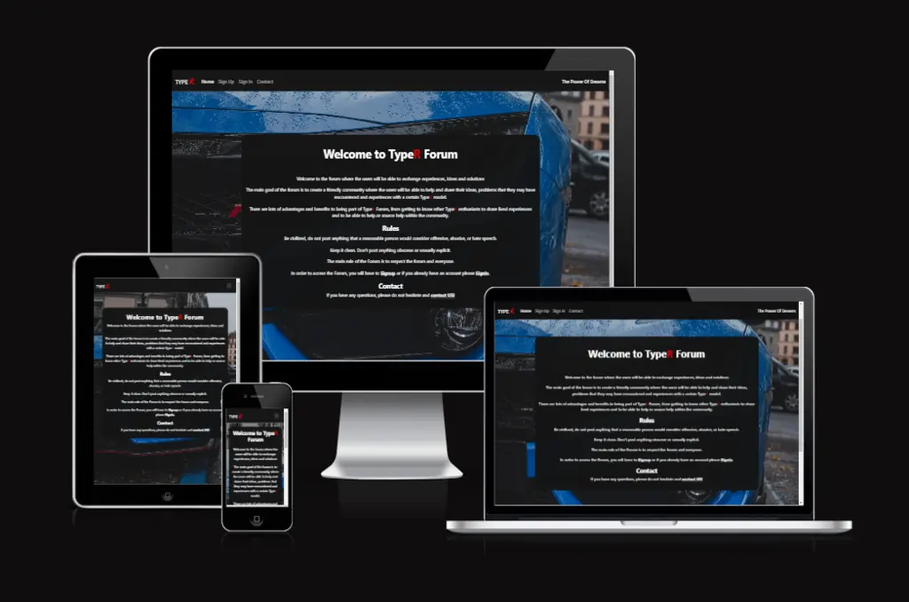

[**Live website**](https://typerforum-fb5dd209c30e.herokuapp.com/)

---

## **Content**

- [**TypeR Forum**](#typer-forum)
  - [**Content**](#content)
  - [**User Experience**](#user-experience)
    - [**Visitors**](#visitors)
    - [**Goals**](#goals)
    - [**The TypeR forum**](#the-typer-forum)
  - [**Agile**](#agile)
    - [**MoSCoW prioritization method**](#moscow-prioritization-method)
    - [**User Stories(Epics)**](#user-storiesepics)
      - [**Epic 1 - Structure**](#epic-1---structure)
      - [**Epic 2 - Home and Error Pages**](#epic-2---home-and-error-pages)
      - [**Epic 3 - User Management**](#epic-3---user-management)
      - [**Epic 4 - Forum - Posts**](#epic-4---forum---posts)
      - [**Epic 5 - Forum - Comments**](#epic-5---forum---comments)
      - [**Epic 6 - Admin and Deployment**](#epic-6---admin-and-deployment)
      - [**Epic 7 - Documentation**](#epic-7---documentation)
  - [**Design**](#design)
    - [**Typography**](#typography)
      - [Fonts used](#fonts-used)
      - [Colours used](#colours-used)
    - [Wireframes](#wireframes)
    - [**Features**](#features)
  - [**Technologies, libraries, programs and tools used**](#technologies-libraries-programs-and-tools-used)
  - [**Languages**](#languages)
    - [**HTML**](#html)
    - [**CSS**](#css)
    - [**JavaScript**](#javascript)
    - [**Python**](#python)
  - [**Accessibility**](#accessibility)
    - [**Wave**](#wave)
    - [**Lighthouse**](#lighthouse)
  - [**Testing**](#testing)
  - [**Bugs**](#bugs)
  - [**Deployment**](#deployment)
    - [**My Deployment**](#my-deployment)
    - [**Local Deployment**](#local-deployment)
      - [Fork the repository](#fork-the-repository)
      - [Clone the repository](#clone-the-repository)
      - [Heroku deployment](#heroku-deployment)
  - [**Credits**](#credits)
  - [**Acknowledgments**](#acknowledgments)

---

## **User Experience**

### **Visitors**

- Users will experience a friendly community where users and moderators cooperate together to help each other.
- Users will be provided with all the support that they might need.
- The website forum content is carefully supervised to make sure that everyone is being respected.
- The objective of the TypeR forum is to get the TypeR community together.

### **Goals**

- The main goal of the forum is to create a community where people will help and share their problems that they may have encountered.
- To share experiences with a certain TypeR model that they might have had.
- To try help each other with certain problems that they have encountered by sharing any thoughts and ideas.
- x

### **The TypeR forum**

- The website is presented with a welcoming message in the Home page.
- The navbar if you are not logged in will have the following options:
  - **Home** - If pressed takes you to Home page where you will have a welcoming message with a Typer in the background
  - **Sign Up** - If pressed takes you to the Sign Up page where you will be able to register to access the Forum, once you have filled the form and submitted a notification will be presented to let you know that you have signed up and logged in.
  - **Sign In** - If pressed takes you to the Login page where you will be able to login so you can access the Forum and your profile, once you have filled the form and pressed sign in a notification will be presented to let you know that you are logged in.
  - **Contact** - If pressed takes you to the contact page where you will be presented with a form to fill and submit in case you need to contact the support
- If you are logged in the navbar will have the following options:
  - **Hello,'username'** - If pressed takes you to your profile where you will be able to update it.
  - **Home** - If pressed takes you to Home page where you will have a welcoming message with a Typer in the background
  - **Forum** - If pressed takes you to the Forum where you will be able to read other Users posts and share your experiences.
  - **Logout** - If pressed takes you to the logout page where you can confirm it, once logout a notification will be presented to let you know that you have logged out.
  - **Contact** - If pressed takes you to the contact page where you will be presented with a form to fill and submit in case you need to contact the support
- User profile lets you:
  - Edit profile so its always updated with the correct details.
- Once in the Forum page you will be able to:
  - View the Users posts, this page is paginated, will show up to four posts per page
  - Add a post so others can see your ideas
  - In the navbar you have a search bar where you will be able to look for a certain post
- If User is the admin you will have extra features:
  - Admin page button in the navbar which will take you to the Admin page where you will be able to control the Website/Forum/Users
  - Admin also will have within the Forum access to Users profiles to prevent any abusive content.

[**Back to the top**](#typer-forum "back_to_the_top")

---

## **Agile**

I did develop this project using agile methodology.

### **MoSCoW prioritization method**

- The MoSCoW prioritization method was utilized for the project in order to achieve the goals.
- The MoSCoW categories:
  - Must-Have - They are guaranteed to be delivered as they are critical in order to success.
  - Should-Have - They do complement the project by adding value but vital for it to run, so they can be added in future.
  - Could-Have - If not implemented it will not affect the functionality, but could improve User/Customer experience.
  - Won't-Have - It is not a priority for this iteration.
  - For more info on MoSCoW method please click [here](https://monday.com/blog/project-management/moscow-prioritization-method/)
- I have created a Kanban using Github projects, the User story template and labels were created following [Code Institute](https://learn.codeinstitute.net/courses/course-v1:CodeInstitute+AG101+2021_T1/courseware/a4e548ca70a3473aa890ba2ab9bf612c/db69a5829de8467eb071e63bde630a2e/?child=last) and where in each user story I have added acceptance criteria and tasks that needed to be completed in order to close them. The Kanban can be found [here](https://github.com/users/b1ndark/projects/5/views/1).

  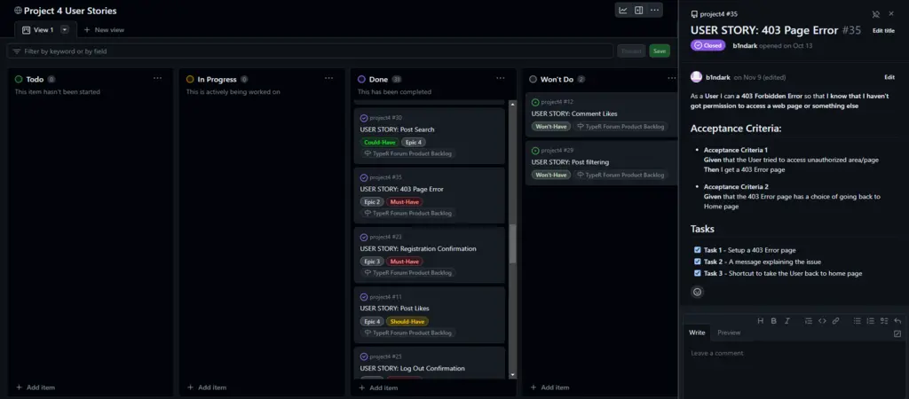

### **User Stories(Epics)**

#### **Epic 1 - Structure**

- As a developer I can create a base.html file so that all other pages can reuse it
- As a developer I can create static folder so that it can store all the other subfolders and files
- As a developer I can create a footer so that it can store all socials
- As a developer I can create a navbar so that it can store all import links to their respective pages for the User to access
- As developer I can create a includes folder so that I can store the navbar and footer file in it to keep the file tidy
- As developer I can Setup all the import features so that it is ready to deploy to heroku

#### **Epic 2 - Home and Error Pages**

- As a User I can view the home page so that I get a welcome message
- As a User I can get 404 Error page so that I know that something went wrong
- As a User I can a 403 Forbidden Error so that I know that I haven't got permission to access a web page or something else
- As a User I can get a 500 error page so that I know that there was a internal server error

#### **Epic 3 - User Management**

- As a User I can sign up/register so that I can login
- As a User I can check for registration confirmation so that I know that I have successfully registered
- As a User I can login so that I can load my account
- As a user I can see a confirmation of login so that I know that I have successfully logged in
- As a User I can view Profile page so that I can modify or view other users profile

#### **Epic 4 - Forum - Posts**

- As a User I can select Forum page so that I can view posts
- As a User I can view a post so that I can be updated
- As a User I can search so that I easily find the post
- As a User I can add a post to the forum so that the community can see my post in order to help others or be helped
- As a User I can edit a post so that I can correct grammar errors
- As a User I can delete a post that I have created so that the post is deleted from the forum

#### **Epic 5 - Forum - Comments**

- As a User I can view comments so that I can see what people have commented on posts
- As a User I can add a comment to the post that I am interested in so that other users/post owner can read my opinion
- As a User I can receive a notification so that I know that my comment has successfully been posted
- As a user I can edit a comment so that comment is corrected/updated

#### **Epic 6 - Admin and Deployment**

- As a Admin I can login so that I can manage the forum
- As a Admin I want to access the admin page so that I can Add/Edit/Modify Posts, I can delete Users, I can delete comments
- As a developer I can deploy the website to heroku so that Users can start using it
- As a User I can receive a confirmation from contact support so that I know that my message is being dealt with

#### **Epic 7 - Documentation**

- Write the readme with all documentation
  - Content nav menu
  - User Experience
  - Document all tests done to the project
  - Address all recourses used to complete the project

[**Back to the top**](#typer-forum "back_to_the_top")

---

## **Design**

### **Typography**

#### Fonts used

From [Google Fonts](https://fonts.google.com/ "google_fonts"):

- [**'Noto Sans JP', sans-serif**](https://fonts.google.com/noto/specimen/Noto+Sans+JP?preview.text=Hello%20World!&noto.query=Noto+Sans+JP&noto.lang=ja_Jpan&noto.script=Jpan&query=Noto+Serif+Japanese)
- [**'Noto Serif JP', serif**](https://fonts.google.com/noto/specimen/Noto+Serif+JP?preview.text=Hello%20World!&noto.query=Noto+Serif+JP&noto.lang=ja_Jpan&noto.script=Jpan&query=Noto+Serif+Japanese)

#### Colours used

- Grey colour: #2c2b2ce3 - Used for the background
- Very dark colour: #161516f3 - Used for the navbar
- Red colour: #b90a0a - Used on the R logo and the likes(heart)
- Black colour: #000000
- White colour: rgba(255, 255, 255, .55) - Used on text
- Dark Grey colour: #2c2b2cc9 - Used on Posts background
- Dark Red colour: rgba(235, 14, 14, 0.26) - Used for box shadows
- Red colour: rgba(235, 14, 14, 0.699) - Used for Anchor element/id_body/form_input_checked
- Dark Red colour: rgba(161, 23, 23, 0.699) - Used for Anchor element when hovered
- White colour: #fff - Used for form-control:focus background-color


[**Back to the top**](#typer-forum "back_to_the_top")

---

### Wireframes

- Wireframes created for both mobiles and desktops
  
  - **Home page**

    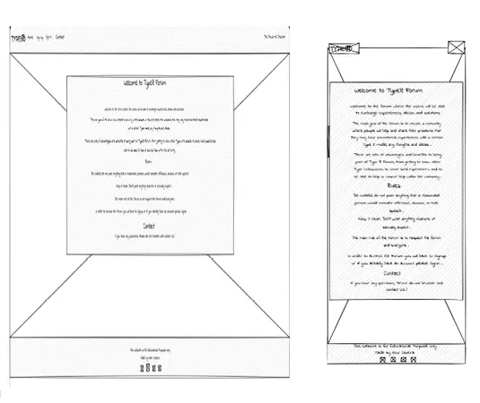

  - **Contact page**

    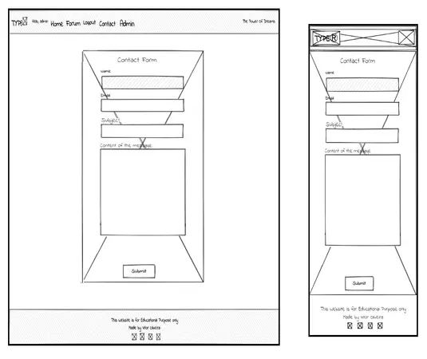

  - **Signup page**

    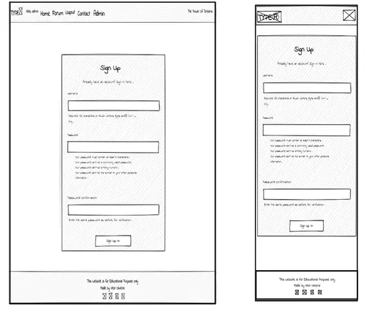

  - **Signin page**

    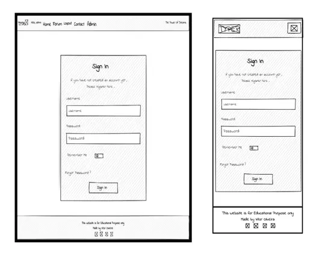

  - **Logout page**

    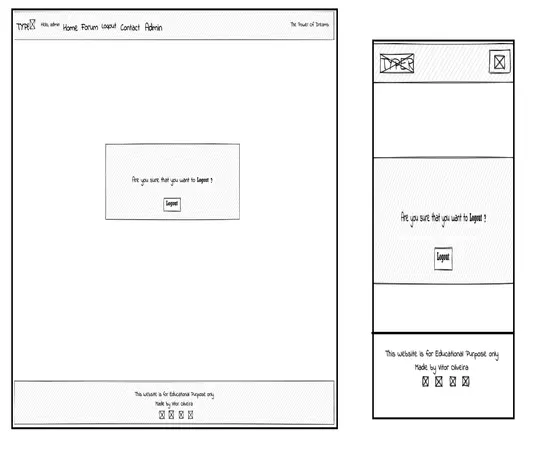

  - **Profile page**

    

  - **Edit profile page**

    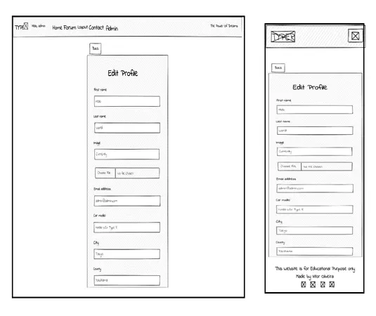

  - **Delete account page**

    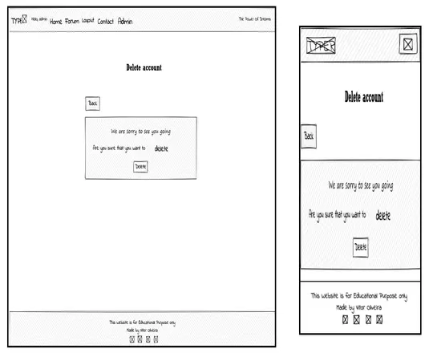

  - **Forum page**

    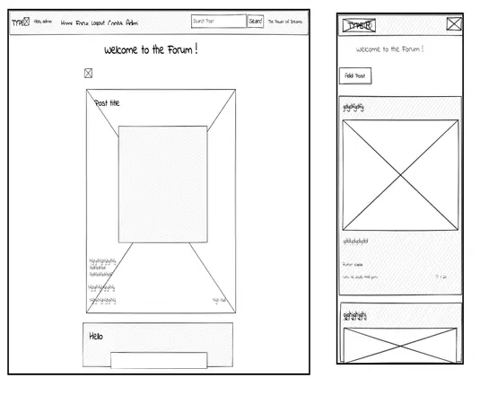

  - **Forum detail page**

    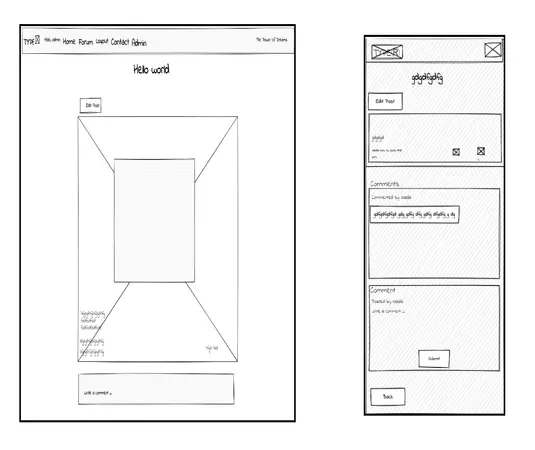

  - **Add post page**

    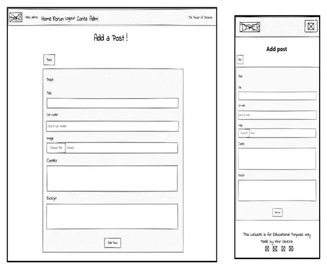

  - **Edit post page**

    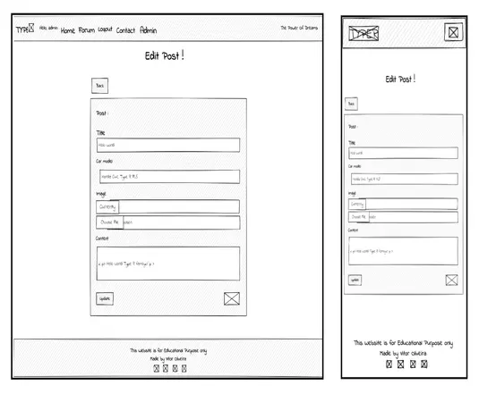

  - **Delete post page**

    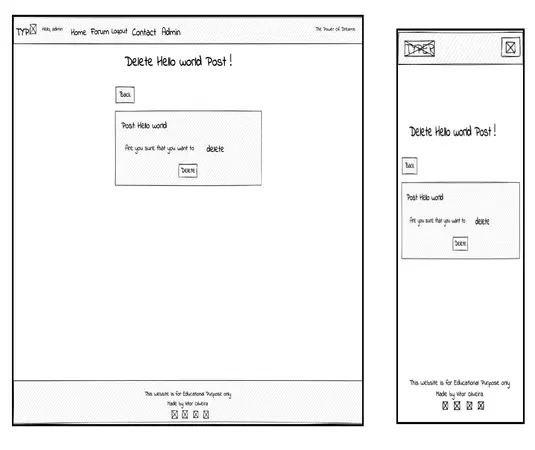

  - **Edit comment page**

    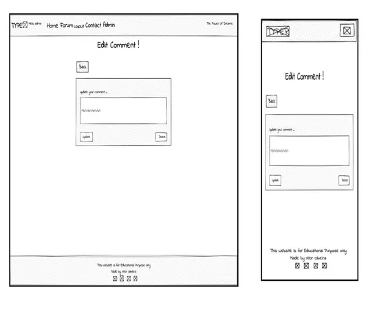

  - **Delete comment page**

    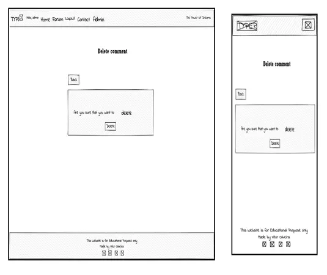

  - **403 Error page**

    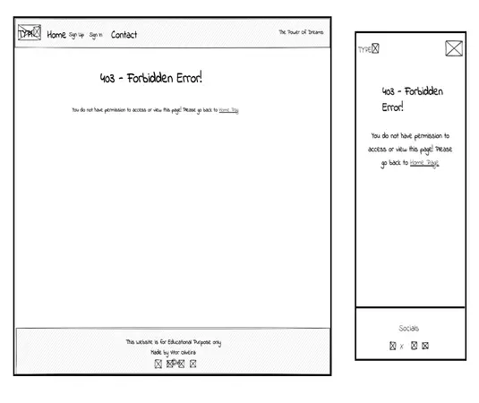

  - **404 Error page**

    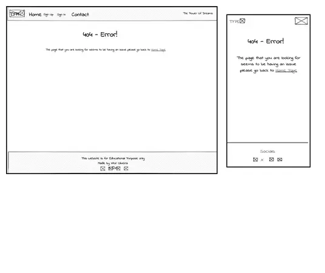

  - **500 Error page**

    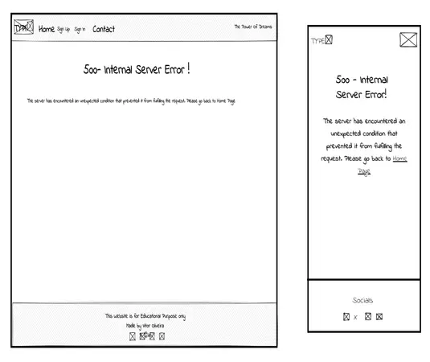

[**Back to the top**](#typer-forum "back_to_the_top")

---

### **Features**

- #### Nav Bar

  - Once in the website the User will be presented with a navbar at the top of the page which is fixed so it follows the User so the same one doesn't have to scroll up to find it.
  - Within the navbar the User will find the following buttons/links

    - The forum logo on the left if pressed takes you back to the home page
    - Home button which when pressed will take you to the home page
    - Contact button that will take you to the contact page so you can get in touch with the support for any kind of matter
    - If not Logged In it will display the following
      - Sign Up button that will take you to the Signup page where the User will be able to register to access the Forum by filling the form.
      - Sign In button to take the User to the Login page to enable access to the Forum
    - If Logged In the navbar will have the following displayed
      - Forum button which when pressed will take you to the Forum where you will be able to explore, add and comments posts
      - Log Out button that will take you to the Log Out page so the User can confirm
    - If Admin is Logged In you will have an extra button
      - Admin button to take you to the admin page where you can manage the website

    - **Desktop navbar**
    - The navbar displays all the menus for the user to navigate.
    - Within the forum also has search bar.

    

    - **Small Screens navbar**
    - When using devices with small screens the navbar adapts, by putting all the navbar menus into to the dropdown button.
    - Also in the small screens when in the forum the search bar moves out of the navbar to improve the user experience, as it wouldn't be practical to click the dropdown menu just to access the search bar.

    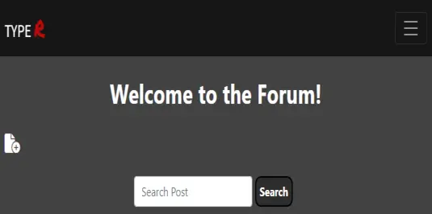

- #### Footer

  - The User is presented a message 'This Website is for Educational Purpose only'
  - Website Author and Socials

    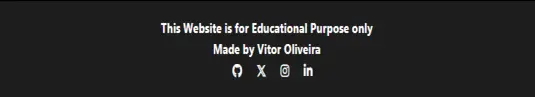

- #### Home Page

  - The User is presented with a welcoming message and a few basic rules.
  - Within the context there is also direct links to signup, sign in and contact pages.
  - It is presented with a blue Honda civic Type R in the background.

    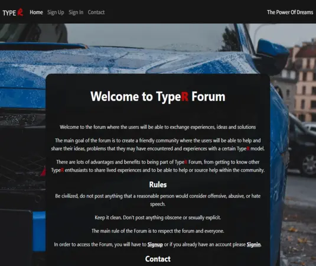

- #### Contact Page

  - The User will be presented with a form to fill in case in need of contacting the support for any reason/matter.
  - If Submitted the User will get a notification.

    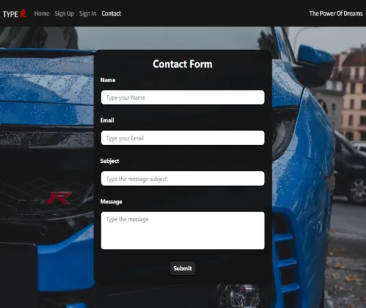
    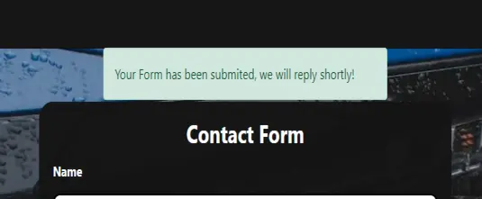

  - You will also get an email confirming it with a copy of what you wrote in your form.

    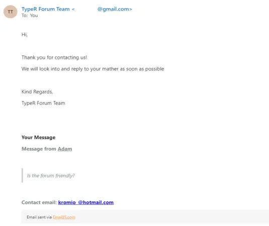

- #### Sign Up Page

  - The User will have a Signup form within the Signup page to fill in case the same one wants to become part of the TypeR community.
  - If Submitted the User will get a notification and automatically logged in.

    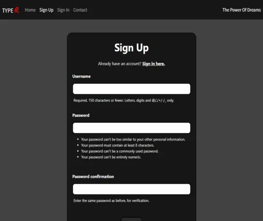

- #### Sign In Page

  - The User will have a Login form to fill if already has a login and wants to access the Forum and be part of the community.
  - If the user logs in, it will be redirected to the Home page and a notification will display.
  - If the User does not have a login there is a link to press that will take him/her to the Sign Up page.

    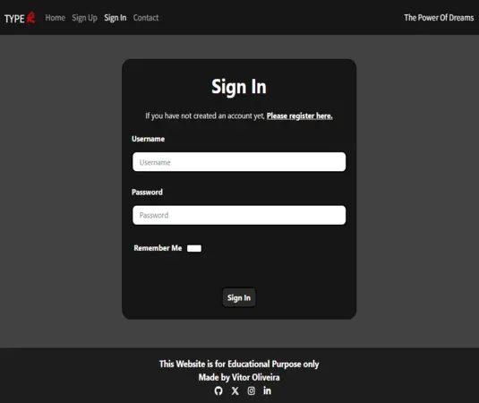

- #### Log Out Page

  - Within the log out page the User will have a question whether wants to log out.
  - If confirmed it will be redirected to the Home page and a notification displayed.

    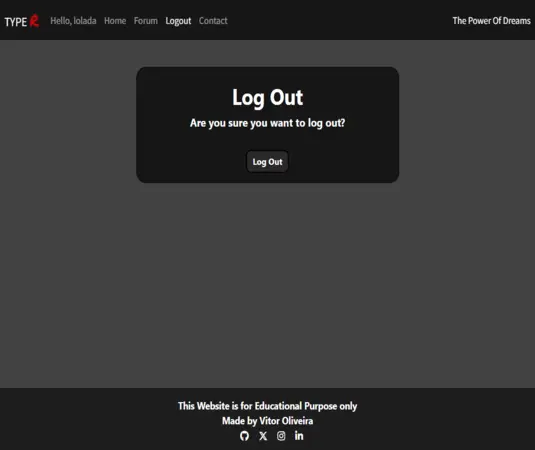

- #### Profile Page

  - If the user clicks on its name within the navbar, it will that them to their profile.
  - Profile page will be presented with a default picture, and with some info and socials if user has entered them.
  - Also, it has two buttons, edit and delete.
  - Edit - The user will be able to update the profile.
  - Delete - The user will be able to delete the account.

    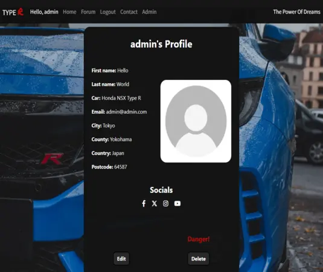

- #### Edit profile Page

  - Within the edit profile page, the User will be presented with a form to update the profile if desired.
  - If User does update the profile, it will be redirected to the profile page and a notification will be displayed.

    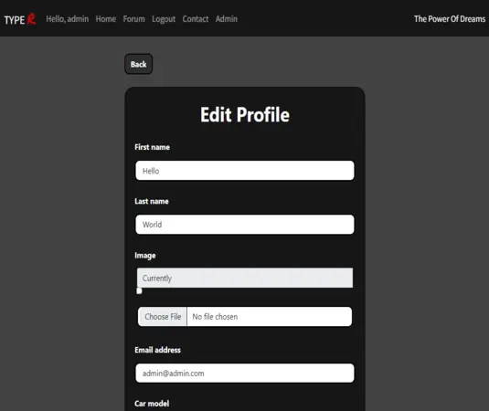
    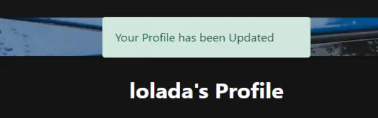

- #### Delete profile Page

  - Within the delete profile page the User will be presented with a question whether is sure to delete the account.
  - If User does delete the account, it will be redirected to the home page and a notification will be displayed to confirm it.

    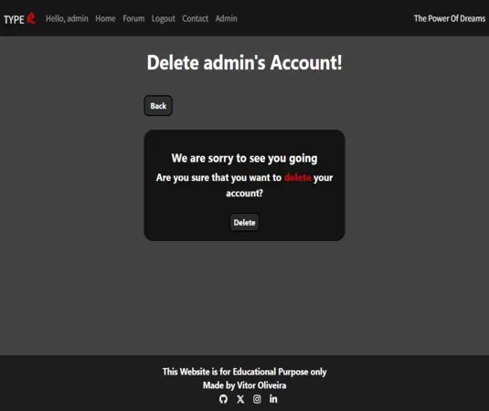
    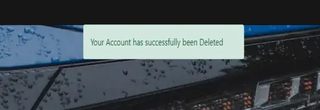

- #### Forum Page

  - The accessed the User will have a list of Posts displayed.
  - If there are more than four posts the page will be paginated where the User will be able to go next/previous page.
  - Within the Forum page a Search bar is displayed in the navbar so the User can look for the pretended post.
  - At the top there is a Add Post button that will take you to the Add Post page so you can add posts and contribute to the community.
  - When a post within the Post list is selected it will take you to the Post detail page.

    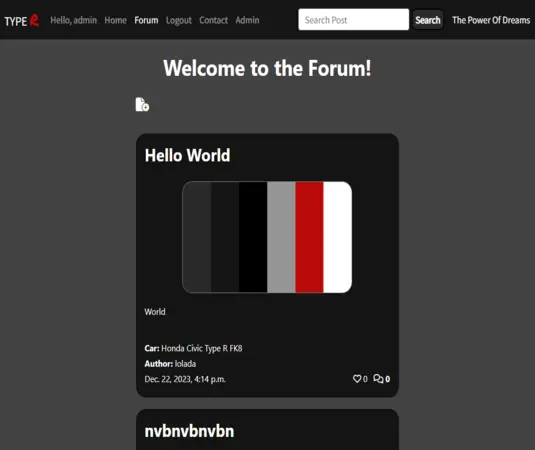

- #### Post Detail Page

  - A post is displayed and the User can comment.
  - If the User is the Post author an Edit button is displayed which when pressed takes you to the Edit Post page.

    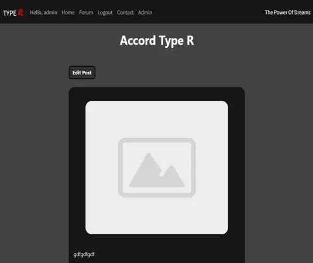

- #### Add post page

  - Add post page displays a form that the User can fill in order to add a post.
  - Posts are used to share experiences, knowledge and help or be helped with some issue.
  - If the User does want to add on picture, it can do it so.
  - If submitted a notification will be displayed confirming it.

    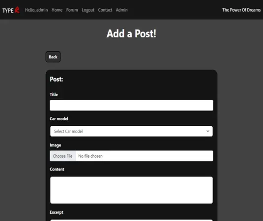
    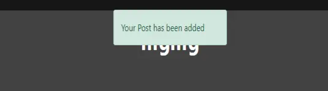

- #### Edit Post Page

  - If User pressed Edit then the Edit page is displayed so the Post can be either edited or deleted.
  - If the Post is edited and submitted a notification will be presented to the User.

    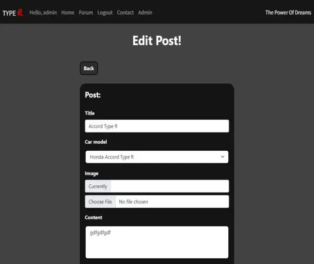

- #### Delete Post Page

  - A Delete Post confirmation is displayed.
  - If the User confirms, the Post is deleted and a notification displayed.

    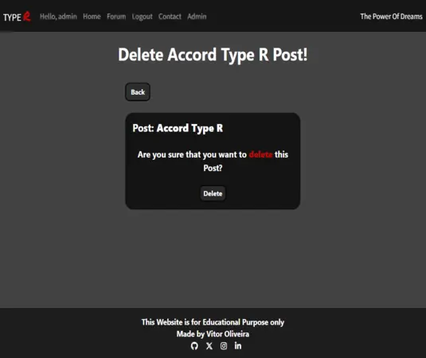

- #### Add Comment

  - A comment is displayed at the bottom of the Post detail page.
  - If the User does want to comment the post just has to write the message and enter.
  - If submitted a notification will be displayed confirming it.

    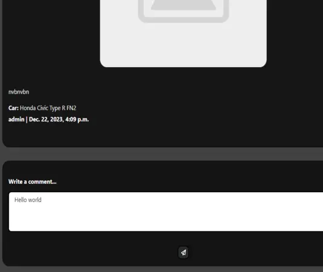
    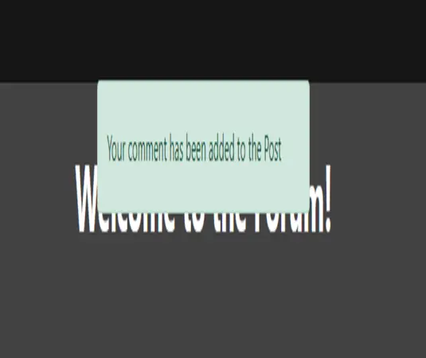

- #### Edit Comment Page

  - If User pressed Edit then the Edit, comment page is displayed so the Comment can be either edited or deleted.
  - If the Comment is edited and submitted a notification will be presented to the User.

    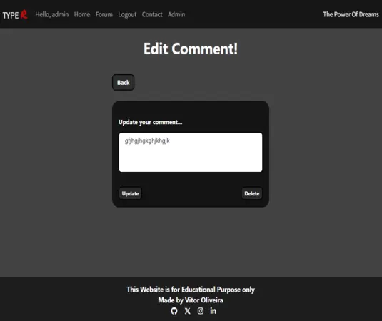

- #### Delete Comment Page

  - A Delete Comment confirmation is displayed.
  - If the User confirms, the Comment is deleted and a notification displayed.

    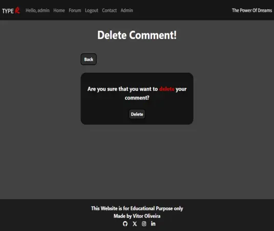

- #### 403 Error Page

  - If the user tries to access something that doesn't belong to him, like for example try to edit somebody else's profile a 403 Error(Forbidden) page will be displayed, so that the user knows that he/she shouldn't be there.
  - Within the 403 Error page there will be a link to take them back to home page.

    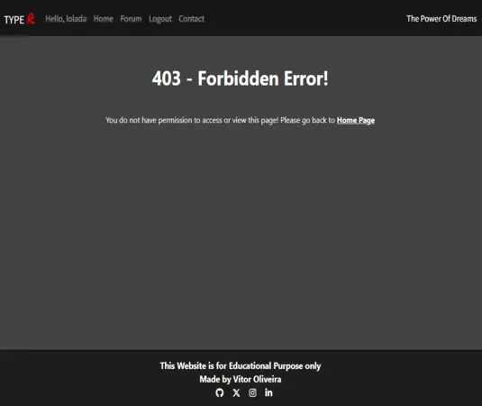

- #### 404 Error Page

  - If the user tries to access something that doesn't exist, a 404 Error page will be displayed, so that the user knows that he/she shouldn't be there/ there is nothing there.
  - Within the 404 Error page there will be a link to take them back to home page.

    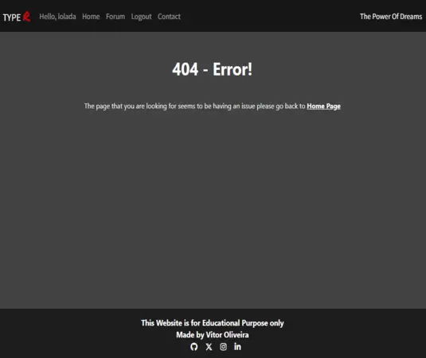

- #### 500 Error Page

  - If the user tries to access something that doesn't exist or never existed, like for example try to view somebody's profile that no longer exists a 500 Error(Server Error) page will be displayed, so that the user knows that there is something wrong with the server.
  - Within the 500 Error page there will be a link to take them back to home page.

    

- #### Admin Page

  - As an Admin, you will have access to the admin page where you will be able to manage the website
    - you will be able to update and delete Users.
    - You will be able to update Users profile.
    - You will be able to add, update and delete posts.
    - You will be able to update and delete comments.

    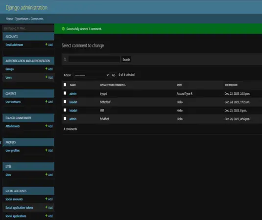

[**Back to the top**](#typer-forum "back_to_the_top")

---

## **Technologies, libraries, programs and tools used**

- [HTML5](https://en.wikipedia.org/wiki/HTML5) - Used to create the templates for the website.
- [CSS](https://en.wikipedia.org/wiki/CSS) - Used to customize the website style.
- [Javascript](https://en.wikipedia.org/wiki/JavaScript) - Used to setup the timeout and emailJS functionality.
- [Python](https://en.wikipedia.org/wiki/Python_(programming_language)) - Python language used in Django.
- [Django](https://en.wikipedia.org/wiki/Django_(web_framework)) - Django which is Python-based web framework used to develop the forum.
- [Bootstrap](https://getbootstrap.com/docs/5.3/getting-started/introduction/) - This toolkit was used to help build the website faster.
- [Codeanywhere](https://app.codeanywhere.com/) - Used to create the project.
- [Github](https://github.com/) - Where the website is stored.
- [Spell Check](https://chrome.google.com/webstore/detail/webpage-spell-check/mgdhaoimpabdhmacaclbbjddhngchjik/related) - Used to check spelling.
- [Gyazo](https://gyazo.com/) - Used to take Screenshots.
- [Cloud Convert](https://cloudconvert.com/) - Used to resize and convert screenshots.
- [W3C HTML](https://validator.w3.org/#validate_by_input) - Used to check for HTML code errors.
- [W3C CSS](https://jigsaw.w3.org/css-validator/) - Used to check for CSS code errors.
- [JSHint](https://jshint.com/) - Used to check for JavaScript code errors.
- [CI Python Linter](https://pep8ci.herokuapp.com/) - Used to check for Python code errors.
- [WAVE](https://wave.webaim.org/) - Used to help improving accessibility to individuals with disabilities, by showing where there might be errors.
- [Heroku](https://dashboard.heroku.com/apps) - Used to deploy the TypeR forum website.
- [Code Institute Template](https://github.com/Code-Institute-Org/ci-full-template) - Used to create project template.
- [ElephantSQL](https://www.elephantsql.com/) - Database used to store the data.
- [Cloudinary](https://cloudinary.com/) - Used to store image.
- [Font Awesome](https://fontawesome.com/) - Used to display icons.
- [Favicon](https://favicon.io/) - Used to create the website favicon.
- [Am I Responsive?](https://ui.dev/amiresponsive) - Used to display the website on different devices.
- [Google Fonts](https://fonts.google.com/) - Used for the fonts in the website.
- [Uizard](https://uizard.io/) - Used to create the website wireframes.
- [Microsoft Word](https://www.microsoft.com/en-gb/microsoft-365/p/word/cfq7ttc0hlkm?activetab=pivot:overviewtab) - Used to write some texts to apply in the project.
- [ColorKit](https://colorkit.co/) - Used to create the colour palette.

[**Back to the top**](#typer-forum "back_to_the_top")

---

## **Languages**

### **HTML**

- **HTML code passes with no errors when checked on W3C Markup Validation Service**

  - Home page results - PASS

  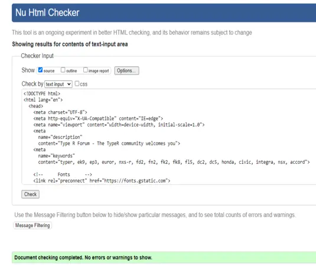

  - Contact page results - PASS

  

  - Signin page results - PASS

  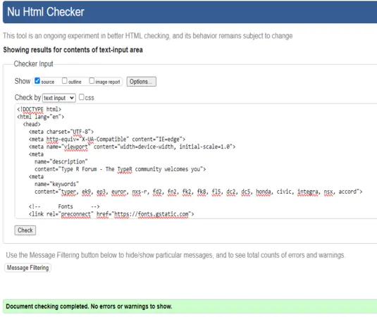

  - Signup page results - PASS

  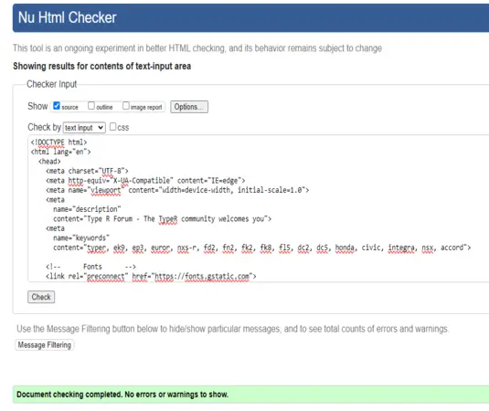

  - Logout page results - PASS

  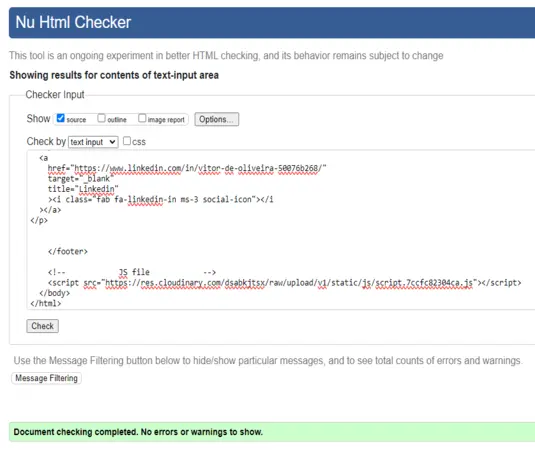

  - Profile page results - PASS

  

  - Edit profile page results - PASS

  

  - Delete profile page results - PASS

  

  - Forum page results - PASS

  

  - Forum detail page results - PASS

  

  - Add post page results - PASS

  

  - Edit post page results - PASS

  

  - Delete post page results - PASS

  

  - Edit comment page results - PASS

  

  - Delete comment page results - PASS

  

  - 403 Error page results - PASS

  

  - 404 Error page results - PASS

  

  - 500 Error page results - PASS

  

### **CSS**

- **CSS code passes with no errors when checked on W3C CSS Validation Service**

  - style.css file - PASS

  

### **JavaScript**

- **JavaScript code passes with no errors when checked on JSHint**

  - Script.js file - PASS

  

### **Python**

- **Python code passes with no errors when checked on CI Python Linter(forum)**

  - page - PASS

  

- **Python code passes with no errors when checked on CI Python Linter(typerforum)**

  - typerforum_views.py - PASS

  

  - typerforum_urls.py - PASS

  

  - typerforum_models.py - PASS

  

  - typerforum_forms.py - PASS

  

  - typerforum_admin.py - PASS

  

- **Python code passes with no errors when checked on CI Python Linter(profiles)**

  - profile_views.py - PASS

  

  - profile_urls.py - PASS

  

  - profile_models.py - PASS

  

  - profile_forms.py - PASS

  

  - profile_admin.py - PASS

  

- **Python code passes with no errors when checked on CI Python Linter(contact)**

  - contact_views - PASS

  

  - contact_urls.py - PASS

  

  - contact_models.py - PASS

  

  - contact_forms.py - PASS

  

  - contact_admin.py - PASS

  

[**Back to the top**](#typer-forum "back_to_the_top")

---

## **Accessibility**

### **Wave**

- I have focused on making sure that the website forum is accessible:

  - Staring with the navbar, made sure to keep it clean, that adapts to mobiles and tables.
  - Maintained the same layout and style through every page within the website.
  - Made sure of semantic HTML.
  - Kept a clean colour contrast in every page.
  - The website forum is simple and easy to navigate.
  - Both edit profile and edit post have an error.

    - Home page results

    

    - Contact page results

    

    - Signin page results

    

    - Signup page results

    

    - Logout page results

    

    - Profile page results

    

    - Edit profile page results

    

    - Delete profile page results

    

    - Forum page results

    

    - Forum detail page results

    

    - Add post page results

    

    - Edit post page results

    

    - Delete post page results

    

    - Edit comment page results

    

    - Delete comment page results

    

[**Back to the top**](#typer-forum "back_to_the_top")

---

### **Lighthouse**

- I can confirm that Lighthouse performed really good

  - Home page results

  

  - Contact page results

  

  - Signin page results

  

  - Signup page results

  

  - Logout page results

  

  - Profile page results

  

  - Edit profile page results

  

  - Delete profile page results

  

  - Forum page results

  

  - Forum detail page results

  

  - Add post page results

  

  - Edit post page results

  

  - Delete post page results

  

  - Edit comment page results

  

  - Delete comment page results

  

[**Back to the top**](#typer-forum "back_to_the_top")

---

## **Testing**

- The Type R Forum has been tested and it works on different types of computers with different browsers:
  - Chrome
  - Safari
  - Microsoft Edge
  - Firefox
- It has been tested and work on different mobile phone brands:

  - Iphone 11 pro
  - Iphone 12 pro
  - Realme x2
  - Xiaomi note 8
  - Hauwei p30 lite
  - Poco F5 pro

- Tests were carried out by myself, friends and family, different devices from desktop PCs, laptops, tables to mobile phones.
- Also in different operating systems from macOS, IOS, Windows to Android.

[**Back to the top**](#typer-forum "back_to_the_top")

---

- ### Navbar

| Feature | Expected Outcome | Testing | Result | Pass or Fail |
| ------- | ---------------- | ------- | ------ | ------------ |
| Forum logo | When clicked to take back to home | Clicked on the logo | Takes me back to home page | pass |
| Home button | When clicked to take back to home | Clicked on the home button | Takes me back to home page | pass |
| Signup button | when clicked to take me to the signup page | Clicked on the signup button | Takes me to the signup page | pass |
| Signin page | When clicked to take me to the signin page | Clicked on the signin button | Takes me to the signin page | pass |
| Contact page | When clicked to take me to the contact page | Clicked on the contact button | Takes me to the contact page | pass |

- ### Navbar when logged in

| Feature | Expected Outcome | Testing | Result | Pass or Fail |
| ------- | ---------------- | ------- | ------ | ------------ |
| Forum logo | When clicked to take back to home | Clicked on the logo | Takes me back to home page | pass |
| Username button | When clicked to take me to the profile page | Clicked on the username button | Takes me to the profile page | pass |
| Home button | When clicked to take back to home | Clicked on the home button | Takes me back to home page | pass |
| Forum page | When clicked to take me to the forum page | Clicked on the Forum button | Takes me to the forum page | pass |
| Logout button | when clicked to take me to the logout page | Clicked on the logout button | Takes me to the logout page | pass |
| Contact page | When clicked to take me to the contact page | Clicked on the contact button | Takes me to the contact page | pass |

- ### Footer

| Feature | Expected Outcome | Testing | Result | Pass or Fail |
| ------- | ---------------- | ------- | ------ | ------------ |
| Github within the footer | When clicked opens my github page in a new tab | Clicked on the github logo | Takes me to the github page in a new tab | pass |
| Twitter within the footer | When clicked opens twitter page in a new tab | Clicked on the twitter(X) logo | Takes me to the twitter page in a new tab | pass |
| Instagram within the footer | When clicked opens instagram page in a new tab | Clicked on the instagram logo | Takes me to the instagram page in a new tab | pass |
| Linkedin within the footer | When clicked opens my linkedin page in a new tab | Clicked on the linkedin logo | Takes me to the linkedin page in a new tab | pass |

- ### Home page

| Feature | Expected Outcome | Testing | Result | Pass or Fail |
| ------- | ---------------- | ------- | ------ | ------------ |
| Within the rules section in the welcome message there is a signup clickable link | When clicked to take to signup page | Clicked on the signup link | Takes me back to the signup page | pass |
| Within the rules section in the welcome message there is a signin clickable link | When clicked to take to signin page | Clicked on the signin link | Takes me back to the signin page | pass |
| Within the contact section in the welcome message there is a contact clickable link | When clicked to take to signup page | Clicked on the signup link | Takes me back to the signup page | pass |

- ### Signup page

| Feature | Expected Outcome | Testing | Result | Pass or Fail |
| ------- | ---------------- | ------- | ------ | ------------ |
| Check whether the form has empty fields or not | When submitting an empty form it will ask to fill the fields | When clicked in the submit button | It will ask to fill the required field | pass |
| Check whether the passwords match | If passwords don't match it will say "The two password fields didn't match", also a notification will be displayed on the top of the screen | Submited form with passwords not matching | A notification is displayed at the top of the screen and also says "The two password fields didn't match" in the form | pass |
| Notification is displayed | When successfully submitted the form a notification is displayed | Submitted form | A notification is displayed after successfully submitted form | pass |
| Login after signing up | To login after form successfully submitted | Submitted form | User logged in | pass |
| Redirect to home | When successfully submitted the form, the user is redirected to home | Submited form | User redirected to home page | pass |

- ### Signin page

| Feature | Expected Outcome | Testing | Result | Pass or Fail |
| ------- | ---------------- | ------- | ------ | ------------ |
| Check whether the login form has empty fields or not | When submitting an empty form it will ask to fill the fields | Clicked in the submit button with empty form/fields | It will ask to fill the required field | pass |
| Check whether the username is correct/exists | If username is incorrect a message is displayed in the form "The username and/or password you specified are not correct." | Submited form with username incorrect | A message is displayed within the form "The username and/or password you specified are not correct." | pass |
| Check whether the password is correct | If password is incorrect a message is displayed in the form "The username and/or password you specified are not correct." | Submited form with passwords incorrect | A message is displayed within the form "The username and/or password you specified are not correct." | pass |
| Notification is displayed | When successfully submit the login form a notification is displayed | Submited login form | A notification is displayed after successfully submitted form | pass |
| Redirect to home page | When successfully submitted the login form, the user is redirected to home | Submited form | User redirected to home page | pass |

- ### Contact page

| Feature | Expected Outcome | Testing | Result | Pass or Fail |
| ------- | ---------------- | ------- | ------ | ------------ |
| Check whether the contact form has empty fields or not | When submitting an empty form it will ask to fill the fields | Clicked in the submit button with empty form/fields | It will ask to fill the required field | pass |
| Notification is displayed | When successfully submit the form a notification is displayed | Submit contact form | A notification is displayed after the form is successfully submitted | pass |
| Contact page refresh | When successfully submit the form, the page refreshes after three seconds | Submitted form | Contact page refreshes three seconds after form is submitted | pass |
| Auto reply email | When successfully submit the form, the user will get an auto reply email | Form submitted | Auto reply email received to let user know that form was seccussefully submitted | pass |

- ### Logout page

| Feature | Expected Outcome | Testing | Result | Pass or Fail |
| ------- | ---------------- | ------- | ------ | ------------ |
| Logout question | Question whether or not the user wants to log out | Press Logout in the navbar | Once logout age loads a question is displayed "Are you sure you want to log out?" | pass |
| Logout once confirmed | When the user presses the button to confirm, the user is logged out | Press the logout button to confirm | The user is logged off | pass |
| Confirm logout notification | When successfully logged out a notification is displayed | Press the logout button to confirm | A notification is displayed to confirm that the user is no longer logged in | pass |
| Redirect to home | When successfully logged out, the user will be redirected to the home page | Press the logout button to confirm | The user is redirected to the home page | pass |

- ### Profile page

| Feature | Expected Outcome | Testing | Result | Pass or Fail |
| ------- | ---------------- | ------- | ------ | ------------ |
| Display profile page | Profile page to display the user information and profile picture | Enter the profile page | Once the profile is displayed the profile picture is displayed and information if user has entered it | pass |
| User profile socials | When the user clicks on one of the socials, the social link will open in a new tab | Press one of the social links | The social network is displayed in a new tab | pass |
| Edit button | When clicked on edit button, a new page is displayed to edit profile | Press the edit button | A new page is displayed with a form to edit profile | pass |
| Delete button | When clicked on, the user will be taken to delete account page | Press delete button | The user is taken to the delete page | pass |

- ### Edit profile page

| Feature | Expected Outcome | Testing | Result | Pass or Fail |
| ------- | ---------------- | ------- | ------ | ------------ |
| Display edit profile page | When Edit profile page is opened should display a edit profile form | Clicked the Edit button | Once clicked the Edit profile form is displayed | pass |
| Back button | When pressing back button, the user should be taken back to profile page | Clicked back button | Once clicked the profile page is displayed | pass |
| User information fields | When the user fills the fields and clicks update, User info is updated in profile page | Fill the form fields and clicked update | All the info is updated in the profile page | pass |
| Image | When user selects a photo and clicks update, the default profile photo is replaced with the new one | New photo selected and click update | The Selected photo is presented as profile photo | pass |
| Notification | When User updates the profile, should show display a notification with "Your profile has been updated" | User updates the profile | A notification is displayed "Your profile has been updated" | pass |
| Redirect to profile | When User updates the profile, should redirect to the profile | User updates the profile | User is redirected to the profile page | pass |
| User authentication | When User tries edit a profile that isn't his, a 403 error page (forbidden) page is displayed | tried to edit the profile from other user | 403-error page is displayed (forbidden) | pass |

- ### Delete account page

| Feature | Expected Outcome | Testing | Result | Pass or Fail |
| ------- | ---------------- | ------- | ------ | ------------ |
| Display question | When delete account page is opened should display a question "Are you sure that you want to delete your account?" | Clicked delete button | Once clicked the question is displayed | pass |
| Back button | When pressing back button, the user should be taken back to profile page | Clicked back button | Once clicked the profile page is displayed | pass |
| Delete button | When user clicks delete button it should delete the account | Clicked delete button | The account gets deleted | pass |
| notification | When user clicks delete button it should delete the account and display a notification | Clicked delete button | The account gets deleted and notification displayed | pass |
| Redirect to home page | When user clicks delete button it should delete the account and redirect to home page | Clicked delete button | The account is deleted and redirected to home page | pass |
| Account deleted | When User tries to loggin after deleting account should display "The username and/or password you specified are not correct." | Tried to loggin again after deleting account | Loggin not successfull and displays the message | pass |
| Posts and comments delete | When deletes account both posts and comments from the same one is deleted | Deleted account | Both posts and comments have been deleted | pass |
| User authentication | When User tries to delete a profile that isn't his, a 403 error page (forbidden) page is displayed | tried to delete the profile from other user | 403 error page is displayed (forbidden) | pass |

- ### Forum page

| Feature | Expected Outcome | Testing | Result | Pass or Fail |
| ------- | ---------------- | ------- | ------ | ------------ |
| List of posts | When in forum page it should display a list of posts | Enter the forum page | Once in the forum page a list of posts is displayed | pass |
| Search bar | When User searches for a post title, That same post should be displayed | Search post title | The post is displayed | pass |
| Search bar empty | When User clicks search with empty field, will get a notification | Search with empty field | A notification is displayed | pass |
| add post | At the top of forum page there should be an add post button to take the user to an add post form | Clicked add post | Add post form is displayed | pass |
| Clickable post title | When clicked on post title, should take the user to the post detail page | clicked on a post title | Post detail page is displayed | pass |
| Pagination (by 4) | When the post list is more than four posts there will be a pagination system | add five posts | pagination buttons are displayed at the bottom of the page before footer | pass |
| Post Info | The post should display Author, date which was created on, total likes and comments. | Created a post | Post shows all info (author, date, likes and comments) | pass |

- ### Add post page

| Feature | Expected Outcome | Testing | Result | Pass or Fail |
| ------- | ---------------- | ------- | ------ | ------------ |
| add post | Add post form | Clicked add post | Once clicked an add post form is displayed | pass |
| Back button | When pressing back button, the user should be taken back to forum page | Clicked back button | Once clicked the forum page is displayed | pass |
| Empty form | If user tries to add post with empty form, should ask to fill out the fields | Clicked add post | An message is displayed "please fill out this field" | pass |
| Submit add post form | When user fills the form and clicks add post, should add the post | Fill the form and clicked add post | The added post detail page is displayed | pass |
| Notification | When post is added it should, display a message "Post has been added" | Fill the form and clicked add post | Notification has been displayed | pass |
| Redirect | User should be redirected to the Created post view | Fill the form and clicked add post | User redirected to the created post view | pass |

- ### Forum detail(Post) page

| Feature | Expected Outcome | Testing | Result | Pass or Fail |
| ------- | ---------------- | ------- | ------ | ------------ |
| Post view | When user selects a post, it should display the post view | Clicked on one of the posts | The Post view is displayed(Post detail/info) | pass |
| Post Info | The post should display Author, date which was created on, total likes and comments. | Created a post | Post shows all info(author, date, likes and comments) | pass |
| Like button | When User clicks the like button it should like the post | Clicked like button | I have liked the post | pass |
| Unlike button | When User clicks the like button after been liked by the same one it should unlike the post | Clicked like button | I have unliked the post | pass |
| Like/Unlike notification | When User likes or unlike the post a notification should be displayed | Clicked like/unlike button | A notification is displayed "You have liked the post" or "You have unliked the post" | pass |
| Comments | If post has comments, a list of comments is displayed underneath the post | Open post view | List of comments is displayed | pass |
| Add comments | At the bottom of the page there should be a comments form to add comments | Open post view | Add comments form displayed at the bottom of the page | pass |
| Comment notification | Once a commented is added, the user should get a notification displayed | Add comment | Notification is displayed "Your comment has been added to the Post" | pass |
| Back button | When pressing back button, the user should be taken back to forum page | Clicked back button | Once clicked the forum page is displayed | pass |

- ### Edit post page

| Feature | Expected Outcome | Testing | Result | Pass or Fail |
| ------- | ---------------- | ------- | ------ | ------------ |
| Display edit post page | When Edit post page is opened should display a edit post form | Clicked the Edit button | Once clicked the Edit post form is displayed | pass |
| Gets current info | When Edit post page is opened should display the current info in the form | Clicked the Edit button | Once clicked the Edit post form is displayed with current info | pass |
| Back button | When pressing back button, the user should be taken back to post page | Clicked back button | Once clicked the post page is displayed | pass |
| update button | When the user updates the fields and clicks update, Post is updated | Update the form fields and clicked update | All the info is updated in the post page | pass |
| Image | When user selects a new image, the default post photo is replaced with the new one | New photo selected and click update | The Selected photo is presented in the post | pass |
| Notification | When User updates the post, should display a notification with "Your post has been updated" | User updates the post | A notification is displayed "Your post has been updated" | pass |
| Redirect to the post detail | When User updates the post, should be redirected to the post | User updates the post | User is redirected to the post detail view page | pass |
| User authentication | When User tries edit a post that isn't his, a 403 error page (forbidden) page should be displayed | tried to edit the post from other user | 403-error page is displayed (forbidden) | pass |
| Delete button | When pressing delete button, the user should be taken to delete post page | Clicked delete button | Once clicked the delete post page is displayed | pass |

- ### Delete post page

| Feature | Expected Outcome | Testing | Result | Pass or Fail |
| ------- | ---------------- | ------- | ------ | ------------ |
| Display question | When delete post page is opened should display a question "Are you sure that you want to delete this Post??" | Clicked delete button | Once clicked the question is displayed | pass |
| Back button | When pressing back button, the user should be taken back to edit post page | Clicked back button | Once clicked the edit post page is displayed | pass |
| Delete button | When user clicks delete button it should delete the post | Clicked delete button | The post is deleted | pass |
| notification | When user clicks delete button it should delete the post and display a notification | Clicked delete button | The post is deleted and notification displayed | pass |
| Redirect to forum page | When user clicks delete button it should delete the post and redirect to forum page | Clicked delete button | The post is deleted and redirected to forum page | pass |
| Comments deleted | When User deletes the post all comments within the post should be deleted | Deleted post | Comments have been deleted with the post | pass |
| User authentication | When User tries to delete a post that isn't his/hers, a 403 error page (forbidden) page is displayed | tried to delete the post from other user | 403 error page is displayed (forbidden) | pass |

- ### Edit comment page

| Feature | Expected Outcome | Testing | Result | Pass or Fail |
| ------- | ---------------- | ------- | ------ | ------------ |
| Display edit comment page | When Edits comment page is opened should display a edit comment form | Clicked the Edit button | Once clicked the Edit comment form is displayed | pass |
| Gets current comment | When Edit comment page is opened should display the current comment in the form | Clicked the Edit button | Once clicked the Edit comment form is displayed with current message | pass |
| Back button | When pressing back button, the user should be taken back to post page | Clicked back button | Once clicked the post page is displayed | pass |
| update button | When the user updates the fields and clicks update, comment is updated | Update the form fields and clicked update | The comment is updated in the post page | pass |
| Notification | When User updates the comment, should display a notification with "Your comment has been updated" | User updates the comment | A notification is displayed "Your comment has been updated" | pass |
| User authentication | When User tries edit a comment that isn't his, a 403 error page (forbidden) page should be displayed | tried to edit the comment from other user | 403 error page is displayed (forbidden) | pass |
| Delete button | When pressing delete button, the user should be taken to delete comment page | Clicked delete button | Once clicked the delete comment page is displayed | pass |

- ### Delete comment page

| Feature | Expected Outcome | Testing | Result | Pass or Fail |
| ------- | ---------------- | ------- | ------ | ------------ |
| Display question | When delete comment page is opened should display a question "Are you sure that you want to delete your comment??" | Clicked delete comment button | Once clicked the question is displayed | pass |
| Back button | When pressing back button, the user should be taken back to edit comment page | Clicked back button | Once clicked the edit comment page is displayed | pass |
| Delete button | When user clicks delete button it should delete the comment | Clicked delete button | The comment is deleted | pass |
| notification | When user clicks delete button it should delete the comment and display a notification to confirm that the comment has been deleted | Clicked delete button | The comment is deleted and notification displayed | pass |
| Redirect to forum page | When user clicks delete button it should delete the comment and redirect to forum page | Clicked delete button | The comment is deleted and redirected to forum page | pass |
| User authentication | When User tries to delete a comment that isn't his/her, a 403 error page (forbidden) page is displayed | tried to delete the comment from other user | 403 error page is displayed (forbidden) | pass |

- ### Admin page

| Feature | Expected Outcome | Testing | Result | Pass or Fail |
| ------- | ---------------- | ------- | ------ | ------------ |
| Delete user | As an Admin I should be able to delete any User | Select User and delete | User has been deleted and notification displayed | pass |
| Update User password | As an Admin I should be able to update Users password | Select User and update his/hers password | Password is updated and a notification is displayed | pass |
| Update User profile | As an Admin I should be able to update User profile | Select User and Update his/hers profile | Profile update and notification displayed | pass |
| Create Posts | As an Admin I should be able to create posts | Select add post and posted it | Post was created and notification was displayed | pass |
| Edit Posts | As an Admin I should be able to update posts | Select the post and update it | Post was updated and notification was displayed | pass |
| Delete Posts | As an Admin I should be able to delete posts | Select the post and delete it | Post was deleted and notification was displayed | pass |
| Edit Comments | As an Admin I should be able to update comments | Select the comment and update it | Comment was updated and notification was displayed | pass |
| Delete Comments | As an Admin I should be able to delete comments | Select the comment and delete it | Comment was deleted and notification was displayed | pass |

[**Back to the top**](#typer-forum "back_to_the_top")

---

## **Bugs**

- I was having an issue with CSRF_TRUSTED_ORIGINS.

  - To fix it I had to add CSRF_TRUSTED_ORIGINS to the app settings.

- Found a bug while testing the comments, once commented if the User refreshed the page it would duplicate the same comment.

  - To fix it I have redirected the User to The Forum after commenting.

- Add Post within the Admin page was working fine but, while on the website when adding a Post the picture wasn't being posted.

  - After looking for the issue found that I needed to add to the form the following

    ```ruby
    enctype="multipart/form-data"
    ```

- When deployed to heroku I was having a bug with the background image as it wasn't showing in the website
  - After the conversation with tutor that helped me understand what was wrong, I then uploaded the image to cloudinary and used the link instead of having it stored within static folder.

- A lot of times that I would modify/update the models I would have errors while running the website
  - I would have to go to ElephantSQL(PostgreSQL databases) look for typerforum app dashboard and reset the database.
  - Then run migrations commands: "python3 manage.py makemigrations", then "python3 manage.py migrate"
  - After create a new super user: "python3 manage.py createsuperuser"

- Custom 500 Error page not displaying.
  - After formating html it messed with the block content tag, had to refactor the html file.

    

[**Back to the top**](#typer-forum "back_to_the_top")

---

## **Deployment**

### **My Deployment**

- The website was deployed to Github pages. Steps to deploy:

1. Open Github
2. Log in into your Github account.
3. In the Github repository select the project.
4. Navigate to the settings tab.
5. Then scroll down and on your left select Pages.
6. Go to branch, and select master branch.
7. Once master branch is selected, wait a moment and it will provide a page link to the website.

- The live link can be found here - [Type R Forum](https://typerforum-fb5dd209c30e.herokuapp.com/).

### **Local Deployment**

#### Fork the repository

1. Open Github.
2. Log in or sign up.
3. Look for my repository [Type R Forum](https://github.com/b1ndark/project4).
4. Last on the right corner you will find the fork button(click on it).

#### Clone the repository

1. Open Github
2. Log in or Sign up
3. Look for my repository [Type R Forum](https://github.com/b1ndark/project4)
4. Look for code button next to the Gitpod button at the top right(click on it).
5. A window will pop up with options for you to select to clone it with such as HTTPS, SSH or GitHub CLI.
6. Once selected copy the link that is shown.
7. Open your code editor terminal.
8. Type `git clone` in the terminal and paste the copied repository link.
9. After all that just Press enter to create the clone.

#### Heroku deployment

1. Within your opened project in Codeanywhere or Gitpod you will have to freeze requirements.txt file

    - Type the command ```pip3 freeze --local > requirements.txt```

    

2. Make sure you commit and push it
3. Open and login to your Heroku account
4. Once your dashboard opens, on the top right-hand corner click on New and then on the Create new app
5. Give your app a name and select the location
6. Once created, the app dashboard will open.
7. Select Settings tab
8. Go down to Config Vars
    - add to Key "PORT" and to value "8000"
    - add to key "CLOUDINARY_URL" and to value "add your cloudinary url"
    - add to key "DATABASE_URL" and to value "add your Postgres url"
    - add to key "SECRET_KEY" and to value "add your secret key"
9. Next go to Buildpacks and add "heroku/python" and "heroku/nodejs"

    - Make sure they are in this order first "heroku/python" and then in second "heroku/nodejs"

10. After all that select Deploy tab
11. Go down to Deployment method and select GitHub
12. Connect to your GitHub and enter the repository
13. Once is connected you can either have automatic or manual deployment
14. Choose your preferred one by pressing deploy

[**Back to the top**](#typer-forum "back_to_the_top")

---

## **Credits**

- ### **Content**

  - Various resources were used to help through out the project:

    - Code Institute Think before I blog tutorial was a good help through out the project, from setting up the project, building it to the deployment.
    - [Font-anwsome libraries](https://cdnjs.com/libraries/font-awesome)
    - [Bootstrap](https://getbootstrap.com/docs/5.3/getting-started/introduction/)
    - Django documentation [Django](https://docs.djangoproject.com/en/5.0/)
    - [Django Crispy forms](https://django-crispy-forms.readthedocs.io/en/latest/install.html)
    - Basic setup and deployment [](https://docs.google.com/document/d/1P5CWvS5cYalkQOLeQiijpSViDPogtKM7ZGyqK-yehhQ/edit#heading=h.5s9novsydyp1)
    - For the forum rules [Elm](https://discourse.elm-lang.org/faq)
    - To help out with active links [Stackoverfow](https://stackoverflow.com/questions/39639264/django-highlight-current-page-in-navbar)
    - For generic views [Django docs](https://docs.djangoproject.com/en/3.2/topics/class-based-views/generic-display/)
    - For Edit generic views [Django docs](https://docs.djangoproject.com/en/3.2/topics/class-based-views/generic-editing/)
    - To display labels in kanban view [Github community](https://github.com/orgs/community/discussions/10788)

  - I have watched some tutorials on Youtube that have helped me with understanding and learning through out the project:

    - [Codemy.com](https://www.youtube.com/playlist?list=PLCC34OHNcOtr025c1kHSPrnP18YPB-NFi)
    - [Dee Mc - Part one](https://www.youtube.com/playlist?list=PLXuTq6OsqZjbCSfiLNb2f1FOs8viArjWy)
    - [Dee Mc - Part Two](https://www.youtube.com/playlist?list=PLXuTq6OsqZjYSa-lrjd5wMGl23zpnhvln)
    - [Tech With Tim](https://www.youtube.com/playlist?list=PLzMcBGfZo4-kQkZp-j9PNyKq7Yw5VYjq9)

  - I have used the Readme structure from my third project as a template.

- ### **Media**

  - Websites Used
    - [Pexels](https://www.pexels.com/)

  - Photos and Authors where to find them:
    - **Background photo** - Photo of a Blue Honda Civic Type R FK8 and author is Liviu Gorincioi [Blue Type R](https://www.pexels.com/photo/close-up-photo-of-a-blue-car-10339797/)
    - Both default Profile and Post pictures I have used the ones from Code Institute [Default profile](https://codeinstitute.s3.amazonaws.com/ReactEssentials/DRF/Images/default_profile.jpg) and [Default post](https://codeinstitute.s3.amazonaws.com/ReactEssentials/DRF/Images/default_post.jpg) in the Advanced Front End specialization sample.

  - The Favicon was created using - [Favicon Generator](https://favicon.io/favicon-generator/)
  - Socials networks used in the footer:
    - [Github](https://github.com/b1ndark)
    - [Linkedin](https://www.linkedin.com/in/vitor-de-oliveira-50076b268/)
    - [Twitter(X)](https://twitter.com/)
    - [Instagram](https://www.instagram.com/)

[**Back to the top**](#typer-forum "back_to_the_top")

---

## **Acknowledgments**

- I would like to thank my mentor [Graeme Taylor](https://github.com/G-Taylor) for helping me along the way in completing my Fourth milestone project.
- I would like to thank Code Institute Tutors for helping me when I had issues along the project.
- Also, I would like to thank friends and family for helping with testing the TypeR Forum.

[**Back to the top**](#typer-forum "back_to_the_top")
