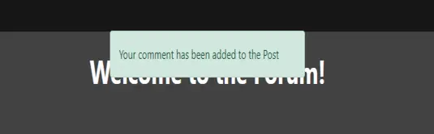
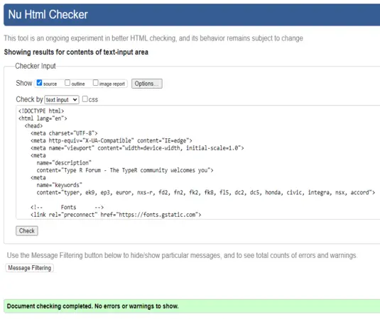
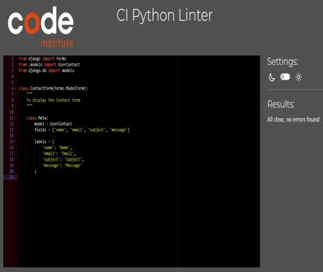
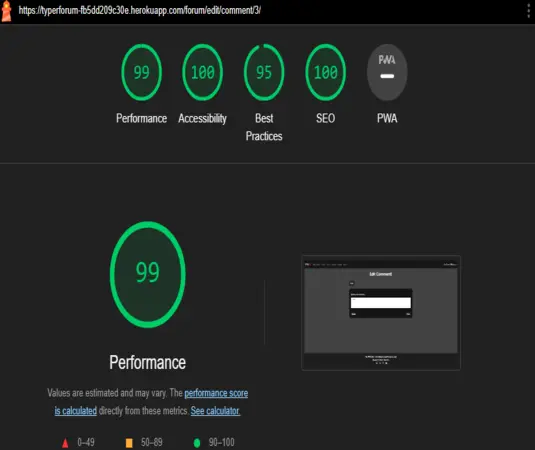

# **TypeR Forum**

`To open the links in this document in a new browser tab please press CTRL + Mouse Click`

## Welcome to [TypeR Forum](https://typerforum-fb5dd209c30e.herokuapp.com/)

Welcome to the forum where the users will be able to exchange experiences, ideias and solutions.

The website is targeted for everyone, from every age group, what it counts and mathers is the TypeR spirit.

You can expect a website that is easy to navigate and a friendly community that is ready to help each other.

The main goal of the forum is to create a comunity where people will help and share their problems that they may have encontered, experiences with a certain TypeR model, any thoughts and ideias.


[**My TypeR Forum website on Am I Responsive**](https://ui.dev/amiresponsive?url=https://typerforum-fb5dd209c30e.herokuapp.com/)

---

## **Content**

- [**TypeR Forum**](#typer-forum)
  - [Welcome to TypeR Forum](#welcome-to-typer-forum)
  - [**Content**](#content)
  - [**User Experience**](#user-experience)
    - [**Visitors**](#visitors)
    - [**Goals**](#goals)
    - [**The TypeR forum**](#the-typer-forum)
  - [**User Stories(Epics)**](#user-storiesepics)
    - [**Epic 1 - Structure**](#epic-1---structure)
    - [**Epic 2 - Home and Error Pages**](#epic-2---home-and-error-pages)
    - [**Epic 3 - User Management**](#epic-3---user-management)
    - [**Epic 4 - Forum - Posts**](#epic-4---forum---posts)
    - [**Epic 5 - Forum - Comments**](#epic-5---forum---comments)
    - [**Epic 6 - Admin and Deployment**](#epic-6---admin-and-deployment)
    - [**Epic 7 - Documentation**](#epic-7---documentation)
  - [**Design**](#design)
    - [**Typography**](#typography)
      - [Fonts used](#fonts-used)
      - [Colours used](#colours-used)
    - [x](#x)
    - [**Features**](#features)
  - [**Programs and tools used**](#programs-and-tools-used)
  - [**Languages**](#languages)
    - [**HTML**](#html)
    - [**CSS**](#css)
    - [**JavaScript**](#javascript)
    - [**Python**](#python)
  - [**Accessibility**](#accessibility)
    - [**Wave**](#wave)
    - [**Lighthouse**](#lighthouse)
  - [**Testing**](#testing)
    - [x](#x-1)
  - [**Bugs**](#bugs)
  - [**Deployment**](#deployment)
    - [**My Deployment**](#my-deployment)
    - [**Local Deployment**](#local-deployment)
      - [Fork the repository](#fork-the-repository)
      - [Clone the repository](#clone-the-repository)
      - [Heroku deployment](#heroku-deployment)
  - [**Credits**](#credits)
  - [**Acknowledgments**](#acknowledgments)

---

## **User Experience**

### **Visitors**

- Users will experience a friendly comunity where users and moderators cooperate together to healp each other.
- Users will be provided with all the support that they might need.
- The website forum content is carefully supervised to make sure that everyone is being respected.
- The objective of the TypeR forum is to get the TypeR community together.

### **Goals**

- The main goal of the forum is to create a comunity where people will help and share their problems that they may have encontered.
- To share experiences with a certain TypeR model that they might have had.
- To try help each other with certain problems thta they have encountered by sharing any thoughts and ideias.
- x

### **The TypeR forum**

- The website is presented with a welcoming message in the Home page.
- The navbar if you are not logged in will have the following options:
  - **Home** - If pressed takes you to Home page where you will have a welcoming message with a Typer in the background
  - **Sign Up** - If pressed takes you to the Sign Up page where you will be able to register to access the Forum, once you have filled the form and submited a notification will be presented to let you know that you have signed up and logged in.
  - **Sign In** - If pressed takes you to the Login page where you will be able to login so you can access the Forum and your profile, once you have filled the form and pressed signin a notification will be presented to let you know that you are logged in.
  - **Contact** - If pressed takes you to the contact page where you will be presented with a form to fill and submit incase you need to contact the support
- If you are logged in the navbar will hvve the following options:
  - **Home** - If pressed takes you to Home page where you will have a welcoming message with a Typer in the background
  - **Hello,'username'** - If pressed takes you to your profile where you will be able to update it.
  - **Forum** - If pressed takes you to the Forum where you will be able to read other Users posts and share your experiences.
  - **Logout** - If pressed takes you to the logout page where you can confirm it, once logout a notification will be presented to let you know that you have logged out.
  - **Contact** - If pressed takes you to the contact page where you will be presented with a form to fill and submit incase you need to contact the support
- User profile lets you:
  - Edit profile so its allways updated with the correct details.
- Once in the Forum page you will be able to:
  - View the Users posts, this page is paginated, will show up to four posts per page
  - Add a post so others can see your ideias
  - In the navbar you have a search bar where you will be able to look for a certain post
- If User is the admin you will have extra features:
  - Admin page button in the navbar which will take you to the Admin page where you will be able to control the Website/Forum/Users
  - Admin also will have within the Forum access to Users profiles to prevent any abusive content.

[**Back to the top**](#typer-forum "back_to_the_top")

---

## **User Stories(Epics)**

### **Epic 1 - Structure**

- As a developer I can create a base.html file so that all other pages can reuse it
- As a developer I can create static folder so that it can store all the other subfolders and files
- As a developer I can create a footer so that it can store all socials
- As a developer I can create a navbar so that it can store all import links to their respective pages for the User to access
- As developer I can create a includes folder so that I can store the navbar and footer file in it to keep the file tidy
- As developer I can Setup all the import features so that it is ready to deploy to heroku

### **Epic 2 - Home and Error Pages**

- As a User I can view the home page so that I get a welcome message
- As a User I can get 404 Error page so that I know that something went wrong
- As a User I can a 403 Forbidden Error so that I know that I haven't got permission to access a web page or something else
- As a User I can get a 500 error page so that I know that there was a internal server error

### **Epic 3 - User Management**

- As a User I can sign up/register so that I can login
- As a User I can check for registration confirmation so that I know that I have successfully registered
- As a User I can login so that I can load my account
- As a user I can see a confirmation of login so that I know that I have successfully logged in
- As a User I can view Profile page so that I can modify or view other users profile

### **Epic 4 - Forum - Posts**

- As a User I can select Forum page so that I can view posts
- As a User I can view a post so that I can be updated
- As a User I can search so that I easily find the post
- As a User I can add a post to the forum so that the community can see my post in order to help others or be helped
- As a User I can edit a post so that I can correct grammar errors
- As a User I can delete a post that I have created so that the post is deleted from the forum

### **Epic 5 - Forum - Comments**

- As a User I can view comments so that I can see what people have commented on posts
- As a User I can add a comment to the post that I am interested in so that other users/post owner can read my opinion
- As a User I can receive a notification so that I know that my comment has successfully been posted
- As a user I can edit a comment so that comment is corrected/updated

### **Epic 6 - Admin and Deployment**

- As a Admin I can login so that I can manage the forum
- As a Admin I want to access the admin page so that I can Add/Edit/Modifty Posts, I can delete Users, I can delete comments
- As a developer I can deploy the website to heroku so that Users can start using it

### **Epic 7 - Documentation**

- Write the readme with all documentation
  - Content nav menu
  - User Experience
  - Document all tests done to the project
  - Address all recourses used to complete the project

[**Back to the top**](#typer-forum "back_to_the_top")

---

## **Design**

### **Typography**

#### Fonts used

From [Google Fonts](https://fonts.google.com/ "google_fonts"):

- [**'Noto Sans JP', sans-serif**](https://fonts.google.com/noto/specimen/Noto+Sans+JP?preview.text=Hello%20World!&noto.query=Noto+Sans+JP&noto.lang=ja_Jpan&noto.script=Jpan&query=Noto+Serif+Japanese)
- [**'Noto Serif JP', serif**](https://fonts.google.com/noto/specimen/Noto+Serif+JP?preview.text=Hello%20World!&noto.query=Noto+Serif+JP&noto.lang=ja_Jpan&noto.script=Jpan&query=Noto+Serif+Japanese)

#### Colours used

- Grey colour: #2c2b2ce3 - Used for the background
- Very dark colour: #161516f3 - Used for the navbar
- Red colour: #b90a0a - Used on the R logo and the likes(heart)
- Black colour: #000000
- White colour: rgba(255, 255, 255, .55) - Used on text
- Dark Grey colour: #2c2b2cc9 - Used on Posts background
- Dark Red colour: rgba(235, 14, 14, 0.26) - Used for box shadows
- Red colour: rgba(235, 14, 14, 0.699) - Used for Anchor element/id_body/form_input_checked
- Dark Red colour: rgba(161, 23, 23, 0.699) - Used for Anchor element when hovered
- White colour: #fff - Used for form-control:focus background-color


[**Back to the top**](#typer-forum "back_to_the_top")

---

### x


[**Back to the top**](#typer-forum "back_to_the_top")

---

### **Features**

- #### Nav Bar

  - Once in the website the User will be presnted with a navbar at the top of the page which is fixed so it follows the User so the same one doesn't have to scroll up to find it.
  - Within the navbar the User will find the following buttons/links

    - The forum logo on the left if pressed takes you back to the home page
    - Home button which when pressed will take you to the home page
    - Contact button that will take you to the contact page so you can get in touch with the support for any kind of mather
    - If not Logged In it will display the following
      - Sign Up button that will take you to the Signup page where the User will be able to register to access the Forum by filling the form.
      - Sign In button to take the User to the Login page to enable access to the Forum
    - If Logged In the navbar will have the following displayed
      - Forum button which when pressed will take you to the Forum where you will be able to explore, add and commments posts
      - Log Out button that will take you to the Log Out page so the USer can confirm
    - If Admin is Logged In you will have an extra button
      - Admin button to take you to the admin page where you can manage the website

    - **Desktop navbar**
    - The navbar displays all the menus for the user to navigate.
    - Within the forum also has search bar.

    

    - **Small Screens navbar**
    - When using devides with small screens the navbar adapts, by putting all the navbar menus into to the dropdown button.
    - Also in the small screens when in the forum the search bar moves out of the navbar to improve the user experience, as it wouldn'y be practicle to clean the dropdown menu just to access the search bar.

    

- #### Footer

  - The User is presented a message 'This Website is for Educational Purpose only'
  - Website Author and Socials

    

- #### Home Page

  - The User is presented with a welcoming message and a few basic rules.
  - Within the context there is also direct links to signup, sigin and contact pages.
  - It is presented with a blue Honda civic Type R in the background.

    

- #### Contact Page

  - The User will be presented with a form to fill incase in need of conatcting the support for any reason/mather.
  - If Submited the User will get a notification.

    
    

  - You will also get an email confirming it with a copy of what you wrote in your form.
    

- #### Sign Up Page

  - The User will have a Signup form whithin the Signup page to fill incase the same one wantes to become part of the TypeR community.
  - If Submited the User will get a notification and automaticaly logged in.

    

- #### Sign In Page

  - The User will have a Login form to fill if already has a login and wants to access the Forum and be part of the community.
  - If the user logs in, it will be redirected to the Home page and a notification will display.
  - If the User does not have a loggin there is a link to press that will take gim to the Sign Up page.

    

- #### Log Out Page

  - Within the log out page the User will have a question whether wants to log out.
  - If confirmed it will be redirected to the Home page and a notification displayed.

    

- #### Profile Page

  - If the user click on its name within the navbar, it will that them to their profile.
  - Profile page will be presented with a default picture, and with with some info and socials if user has enter them.
  - Also it has two buttons, edit and delete.
  - Edit - The user will be able to update the profile.
  - Delete - The user will be able to delete the account.

    

- #### Edit profile Page

  - Within the edit profile page the User will be presented with a form to update the profile if desired.
  - If User does update the profile it will be redirected to the profile page and a notification will be displayed.

    
    

- #### Delete profile Page

  - Within the delete profile page the User will be presented with a question whether is sure to delete the account.
  - If User does delete the account it will be redirected to the home page and a notification will be displayed to confirm it.

    
    

- #### Forum Page

  - The accessed the User will have a list of Posts displayed.
  - If there is more than four posts the page will be paginated where the User will be able to go next/previous page.
  - Within the Forum page a Search bar is displayed in the navbar so the User can look for the pretended post.
  - At the top there is a Add Post button that will take you to the Add Post page so you can add posts and contribute to the community.
  - When a post within the Post list is selected it will take you to the Post detail page.

    

- #### Post Detail Page

  - A post is displayed and the User can comment.
  - If the User is the Post auhtor an Edit button is displayed which when pressed takes you to the Edit Post page.

    

- #### Edit Post Page

  - If User pressed Edit then the Edit page is displayed so the Post can be either edited or deleted.
  - If the Post is edited and submited a notification will be pressented to the User.

    

- #### Delete Post Page

  - A Delete Post confirmation is displayed.
  - If the User confirms, the Post is deleted and a notification displayed.

    

- #### Add Comment

  - A comment is displyed at the bottom of the Post detail page.
  - If the User does want to comment the post just has to write the message and enter.
  - If submited a notification will be displayed confirming it.

    
    

- #### Edit Comment Page

  - If User pressed Edit then the Edit comment page is displayed so the Comment can be either edited or deleted.
  - If the Comment is edited and submited a notification will be pressented to the User.

    

- #### Delete Comment Page

  - A Delete Comment confirmation is displayed.
  - If the User confirms, the Comment is deleted and a notification displayed.

    

- #### 403 Error Page

  - If the user tries to access something that doesn't belong to him, like for example try to edit somebody elses profile a 403 Error(Forbidden) page will be displayed, so that the user knows that he/she shouldn't be there.
  - Within the 403 Error page there will be a link to take them back to home page.

    

- #### 404 Error Page

  - If the user tries to access something that doesn't exist, a 404 Error page will be displayed, so that the user knows that he/she shouldn't be there/ there is nothing there.
  - Within the 404 Error page there will be a link to take them back to home page.

    

- #### 500 Error Page

  - If the user tries to access something that doesn't exist or never existed, like for example try to view somebodys profile that no longer exists a 500 Error(Server Error) page will be displayed, so that the user knows that there is something wrong with the server.
  - Within the 500 Error page there will be a link to take them back to home page.

    

[**Back to the top**](#typer-forum "back_to_the_top")

---

## **Programs and tools used**

- [Codeanywhere](https://app.codeanywhere.com/) - Used to create the project.
- [Github](https://github.com/) - Where the website is stored.
- [Spell Check](https://chrome.google.com/webstore/detail/webpage-spell-check/mgdhaoimpabdhmacaclbbjddhngchjik/related) - Used to check spelling.
- [Gyazo](https://gyazo.com/) - Used to take Screenshots.
- [Cloud Convert](https://cloudconvert.com/) - Used to resize and convert screenshots.
- [W3C HTML](https://validator.w3.org/#validate_by_input) - Used to check for HTML code errors.
- [W3C CSS](https://jigsaw.w3.org/css-validator/) - Used to check for CSS code errors.
- [JSHint](https://jshint.com/) - Used to check for JavaScript code errors.
- [CI Python Linter](https://pep8ci.herokuapp.com/) - Used to check for Python code errors.
- [WAVE](https://wave.webaim.org/) - Used to help improving accessibility to individuals with disabilities, by showing where there might be errors.
- [screen Pal](https://screenpal.com/) - Used to record the screen.
- [Giphy](https://giphy.com/create/gifmaker) - Used to create gifs.
- [Heroku](https://dashboard.heroku.com/apps) - Used to deploy the TypeR forum website.
- [Code Institute Template](https://github.com/Code-Institute-Org/ci-full-template) - Used to create project template.
- [ElephantSQL](https://www.elephantsql.com/) - Database used to store the data.
- [Font Awesome](https://fontawesome.com/) - Used to display icons.
- [Favicon](https://favicon.io/) - Used to create the website favicon.
- [Am I Responsive?](https://ui.dev/amiresponsive) - Used to display the website on different devices.
- [Google Fonts](https://fonts.google.com/) - Used for the fonts in the website.
- [Uizard](https://uizard.io/) - Used to create the website wireframes.
- [Microsoft Word](https://www.microsoft.com/en-gb/microsoft-365/p/word/cfq7ttc0hlkm?activetab=pivot:overviewtab) - Used to write some texts to apply in the project.
- [ColorKit](https://colorkit.co/) - Used to create the colour palette.

[**Back to the top**](#typer-forum "back_to_the_top")

---

## **Languages**

### **HTML**

- **HTML code passes with no errors when checked on W3C Markup Validation Service**

  - Home page results - PASS

  

  - Contact page results - PASS

  

  - Signin page results - PASS

  

  - Signup page results - PASS

  

  - Logout page results - PASS

  

  - Profile page results - PASS

  

  - Edit profile page results - PASS

  

  - Delete profile page results - PASS

  

  - Forum page results - PASS

  

  - Forum detail page results - PASS

  

  - Add post page results - PASS

  

  - Edit post page results - PASS

  

  - Delete post page results - PASS

  

  - Edit comment page results - PASS

  

  - Delete comment page results - PASS

  

  - 403 Error page results - PASS

  

  - 404 Error page results - PASS

  

  - 500 Error page results - PASS

  

### **CSS**

- **CSS code passes with no errors when checked on W3C CSS Validation Service**

  - style.css file - PASS

  

### **JavaScript**

- **JavaScript code passes with no errors when checked on JSHint**

  - Script.js file - PASS

  

### **Python**

- **Python code passes with no errors when checked on CI Python Linter(forum)**

  - page - PASS

  

- **Python code passes with no errors when checked on CI Python Linter(typerforum)**

  - typerforum_views.py - PASS

  

  - typerforum_urls.py - PASS

  

  - typerforum_models.py - PASS

  

  - typerforum_forms.py - PASS

  

  - typerforum_admin.py - PASS

  

- **Python code passes with no errors when checked on CI Python Linter(profiles)**

  - profile_views - PASS

  

  - profile_urls.py - PASS

  

  - profile_models.py - PASS

  

  - profile_forms.py - PASS

  

  - profile_admin.py - PASS

  

- **Python code passes with no errors when checked on CI Python Linter(contact)**

  - contact_views - PASS

  

  - contact_urls.py - PASS

  

  - contact_models.py - PASS

  

  - contact_forms.py - PASS

  

  - contact_admin.py - PASS

  

[**Back to the top**](#typer-forum "back_to_the_top")

---

## **Accessibility**

### **Wave**

- I have focused on making sure that the website forum is accessible:

  - Staring with the navbar, made sure to keep it clean, that adaptes to mobiles and tables.
  - Maintained the same layout and style through every page withon the website.
  - Made sure of semantic HTML.
  - Kept a clean colour contrast in every page.
  - The website forum is simple and easy to navigate.
  - Both edit profile and edit post have an error.

    - Home page results

    

    - Contact page results

    

    - Signin page results

    

    - Signup page results

    

    - Logout page results

    

    - Profile page results

    

    - Edit profile page results

    

    - Delete profile page results

    

    - Forum page results

    

    - Forum detail page results

    

    - Add post page results

    

    - Edit post page results

    

    - Delete post page results

    

    - Edit comment page results

    

    - Delete comment page results

    

[**Back to the top**](#typer-forum "back_to_the_top")

---

### **Lighthouse**

- I can confirm that Lighthouse performed really good

  - Home page results

  

  - Contact page results

  

  - Signin page results

  

  - Signup page results

  

  - Logout page results

  

  - Profile page results

  

  - Edit profile page results

  

  - Delete profile page results

  

  - Forum page results

  

  - Forum detail page results

  

  - Add post page results

  

  - Edit post page results

  

  - Delete post page results

  

  - Edit comment page results

  

  - Delete comment page results

  

[**Back to the top**](#typer-forum "back_to_the_top")

---

## **Testing**

- The Type R Forum has been tested and it works on different types of computers with different browsers:
  - Chrome
  - Safari
  - Microsoft Edge
  - Firefox
- It has been tested and work on different mobile phone brands:

  - Iphone 11 pro
  - Iphone 12 pro
  - Realme x2
  - Xiaomi note 8
  - Hauwei p30 lite
  - Poco F5 pro

- Tests were carried out by myself, friends and family, different devices from desktop PCs, laptops, tables to mobile phones.
- Also in diffrent operating systems from macOS, IOS, Windows to Android.

[**Back to the top**](#typer-forum "back_to_the_top")

---

### x

| Feature | Expected Outcome | Testing | Result | Pass or Fail |
| ------- | ---------------- | ------- | ------ | ------------ |
| Title   | #                | #       | #      | pass         |
| #       | #                | #       | #      | pass         |
| #       | #                | #       | #      | pass         |
| #       | #                | #       | #      | pass         |

[**Back to the top**](#typer-forum "back_to_the_top")

---

## **Bugs**

- I was having an issue with CSRF_TRUSTED_ORIGINS.

  - To fix it I had to add CSRF_TRUSTED_ORIGINS to the app settings.

- Found a bug while testing the comments, once commented if the User refreshed the page it would duplicate the same comment.

  - To fix it I have redirected the User to The Forum after commenting.

- Add Post within the Admin page was working fine but, while on the website when adding a Post the picture wasn't being posted.

  - After looking for the issue found that I needed to add to the form the following

    ```ruby
    enctype="multipart/form-data"
    ```

- When deployed to heroku I was having a bug with the background image as it wasn't showing in the website
  - After the conversation with tutor that helped me understand what was wrong I then uploaded the image to cloudinary and used the link instead of having it stored within static folder.

[**Back to the top**](#typer-forum "back_to_the_top")

---

## **Deployment**

### **My Deployment**

- The website was deployed to Github pages. Steps to deploy:

1. Open Github
2. Log in into your Github account.
3. In the Github repository select the project.
4. Navigate to the settings tab.
5. Then scroll down and on your left select Pages.
6. Go to branch, and select master branch.
7. Once master branch is selected, wait a moment and it will provide a page link to the website.

- The live link can be found here - [Type R Forum](x).

### **Local Deployment**

#### Fork the repository

1. Open Github.
2. Log in or sign up.
3. Look for my repository [Type R Forum](x).
4. Last on the right corner you will find the fork button(click on it).

#### Clone the repository

1. Open Github
2. Log in or Sign up
3. Look for my repository [Type R Forum](x)
4. Look for code button next to the Gitpod button at the top right(click on it).
5. A window will pop up with options for you to select to clone it with such as HTTPS, SSH or GitHub CLI.
6. Once selected copy the link that is shown.
7. Open your code editor terminal.
8. Type `git clone` in the terminal and paste the copied repository link.
9. After all that just Press enter to create the clone.

#### Heroku deployment

1. Within your opened project in Codeanywhere or Gitpod you will have to freeze requirements.txt file

    - Type the command ```pip3 freeze > requirements.txt```

2. Make sure you commit and push it
3. Open and login to your Heroku account
4. Once your dashboard opens, on the top right-hand corner click on New and then on the Create new app
5. Give your app a name and select the location
6. Once created, the app dashboard will open.
7. Select Settings tab
8. Go down to Config Vars and add to Key "PORT" and to value "8000"
9. Next go to Buildpacks and add "heroku/python" and "heroku/nodejs"

    - Make sure they are in this order first "heroku/python" and then in second "heroku/nodejs"

10. After all that select Deploy tab
11. Go down to Deployment method and select GitHub
12. Connect to your GitHub and enter the repository
13. Once is connected you can either have automatic or manual deployment
14. Choose your preferred one by pressing deploy

[**Back to the top**](#typer-forum "back_to_the_top")

---

## **Credits**

- ### **Content**

  - #:

    - For the forum rules [Elm](https://discourse.elm-lang.org/faq)
    - [x](x)

  - I have watched some tutorials on Youtube that have helped me with understanding and learning through out the project:

    - [Codemy.com](https://www.youtube.com/playlist?list=PLCC34OHNcOtr025c1kHSPrnP18YPB-NFi)
    - [Dee Mc - Part one](https://www.youtube.com/playlist?list=PLXuTq6OsqZjbCSfiLNb2f1FOs8viArjWy)
    - [Dee Mc - Part Two](https://www.youtube.com/playlist?list=PLXuTq6OsqZjYSa-lrjd5wMGl23zpnhvln)
    - [Tech With Tim](https://www.youtube.com/playlist?list=PLzMcBGfZo4-kQkZp-j9PNyKq7Yw5VYjq9)

  - I have used the Readme structure from my third project as a template.

- ### **Media**

  - Websites Used
    - [Pexels](https://www.pexels.com/)

  - Photos and Authors where to find them:
    - **Background photo** - Photo of a Blue Honda Civic Type R FK8 and author is Liviu Gorincioi [Blue Type R](https://www.pexels.com/photo/close-up-photo-of-a-blue-car-10339797/)
    - Both default Profile and Post pictures I have used the ones from Code Institute [Default profile](https://codeinstitute.s3.amazonaws.com/ReactEssentials/DRF/Images/default_profile.jpg) and [Default post](https://codeinstitute.s3.amazonaws.com/ReactEssentials/DRF/Images/default_post.jpg) in the Advanced Front End specialization sample.

  - The Favicon was created using - [Favicon Generator](https://favicon.io/favicon-generator/)
  - Socials networks used in the footer:
    - [Github](https://github.com/b1ndark)
    - [Linkedin](https://www.linkedin.com/in/vitor-de-oliveira-50076b268/)
    - [Twitter(X)](https://twitter.com/)
    - [Instagram](https://www.instagram.com/)

[**Back to the top**](#typer-forum "back_to_the_top")

---

## **Acknowledgments**

- I would like to thank my mentor [Graeme Taylor](https://github.com/G-Taylor) for helping me along the way in completing my Fourth milestone project.
- I would like to thank Code Institute Tutors for helping me when I had issues along the project.
- Also, I would like to thank friends and family for helping with testing the TypeR Forum.

[**Back to the top**](#typer-forum "back_to_the_top")
